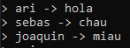
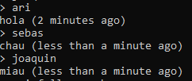
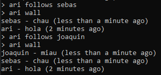

# social-network-console-based

This technical challenge was made with TDD, Jest and Javascript.

  
- When following another user, check if is not already stored in `following` dictionary. Now you can follow more than once to the same user and, in wall, messages are duplicated.

- When following, check if before and after the 'follows' word there is just one word, as it's done in Posting.

### Improvements or future features:

- User management.

- Feedback messages to the user when writes wrong the command, for example "You need to add your username before the arrow. The format is 'username -> message'. Try again". Or when reading others messages and the list is empty, for example "Nothing is posted yet".

  

### About the program:

  

This is a consoled-based program that simulates a social-network.

#### To run the tests:

- Run this command: `npm test`

In order to leave the console open to receive inputs, when running the tests the process also remains open, printing this warning: `Jest did not exit one second after the test run has completed.`
To run the tests again, you must exit the console (`ctrl + c`) and run the tests again.

#### To run the application:

- Run this command: `node src/App.js`

- The console is ready to receive the inputs.

- The commands are:

	- To post a message in your timeline: `username -> message`.

		- You can add many messages to the with the same username or others.

- To read messages from a user: `username`

	- You will read their messages in descending order by time and and how long ago it was posted.

- To follow someone: `username follows another-username`

- To see youw wall: `username wall`

	- You can see your messages and the messages of the users you have been followed.

